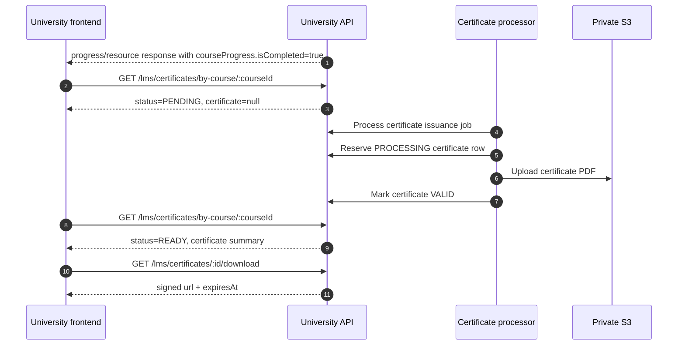

# Certificate Flow

Certificates are the learner artifact created after course completion. The
completion response is immediate; the PDF and the visible certificate become
ready asynchronously.

Read [`../01-foundations.md`](../01-foundations.md) first for shared auth,
envelope, error, ID, timestamp, and throttle handling. The learner path hands
off to this doc when
[`learner-core.md`](./learner-core.md) receives
`courseProgress.isCompleted=true` from a progress or resource-completion
response.

Use Swagger for the current response schemas. This doc defines the frontend
state machine around issuance, download, and public verification.

## Certificate route map

| Frontend need | Endpoint | Contract |
| --- | --- | --- |
| Check post-completion readiness for one course | `GET /lms/certificates/by-course/:courseId` | Returns `NONE`, `PENDING`, `FAILED`, or `READY`. |
| Render the learner certificate list | `GET /lms/my-certificates` | Lists current user's visible certificates. |
| Open owned certificate detail | `GET /lms/certificates/:id` | Returns detail for an owned visible certificate. |
| Download owned certificate PDF | `GET /lms/certificates/:id/download` | Returns a short-lived signed PDF URL. |
| Render QR/public verification result | `GET /lms/certificates/verify/:token` | Public token-based verification response. |

## Async issuance contract

Course completion and certificate PDF availability are separate moments.

When the last required lesson completes, the progress flow transaction:

1. Marks course progress completed.
2. Marks the enrollment completed.
3. Creates or reuses a durable certificate issuance job for the learner and
   course.

Certificate processing then reserves certificate metadata, renders the PDF,
uploads it to S3, and changes the certificate from `PROCESSING` to `VALID` only
after the upload succeeds.

The frontend should show course completion immediately. It should not render a
live Download Certificate action until certificate readiness says the
certificate is available.

## Completion to download sequence



## Poll readiness after completion

Prefer the course-scoped readiness route after completion:

```text
GET /lms/certificates/by-course/:courseId
```

Start this flow when a progress tick or resource completion response says:

```json
{
  "courseProgress": {
    "isCompleted": true
  }
}
```

The progress response does not carry certificate readiness directly. Query the
readiness endpoint with the same course UUID.

```json
{
  "data": {
    "status": "PENDING",
    "certificate": null
  }
}
```

Suggested screen behavior:

1. Show the course-completed state immediately.
2. Poll readiness every 2 seconds while the completion screen is active.
3. Stop the eager poll loop after about 30 seconds.
4. Keep a refresh path so the learner can check again later.

The frontend can also refresh `GET /lms/my-certificates` after readiness turns
`READY`, but the list route is not the best first signal for one newly completed
course.

## Readiness states

Readiness is the issuance state for one learner/course pair. It is not the same
thing as the certificate's visible status.

| Readiness | Response shape | Frontend treatment |
| --- | --- | --- |
| `NONE` | `certificate: null` | No issuance job and no visible certificate found. Do not promise a certificate unless the course completion path just fired. |
| `PENDING` | `certificate: null` | Issuance job is pending or processing. Show processing state and keep the bounded poll loop running. |
| `FAILED` | `certificate: null` | A backend issuance attempt failed. Show processing/retry copy and allow later refresh. |
| `READY` | `certificate: { ... }` | A non-processing certificate is visible. Render its own `status` before enabling actions. |

For example, a `READY` response can include a `REVOKED` or `EXPIRED`
certificate later in its lifecycle. Do not treat readiness `READY` as a synonym
for certificate status `VALID`.

## Issuance failure and retry

Failed issuance work is durable. Backend retry processing revisits failed
certificate jobs on a 15-minute cron and is designed to reuse the existing
reserved certificate path instead of minting duplicate valid certificates.

The learner UI should avoid copy that says issuance is permanently lost. A
bounded failure state such as "Certificate is still processing. Check again
shortly." matches the backend behavior better than a dead download button.

## My Certificates list

Use:

```text
GET /lms/my-certificates
```

The list excludes `PROCESSING` certificate rows and sorts visible certificates
by issued time descending. It can include these certificate statuses:

| Certificate status | Meaning for learner UI |
| --- | --- |
| `VALID` | Certificate is current. |
| `EXPIRED` | Certificate was issued but passed its expiry date. The current owned download route does not block this status. |
| `REVOKED` | Certificate exists but was revoked by an admin action. Owned download is blocked. |

Treat the status on each certificate row as UI state. Do not infer validity only
from the fact that it appears in the list.

## Owned certificate detail

Use:

```text
GET /lms/certificates/:id
```

Only the owning user can read certificate detail. A processing certificate is
not exposed through this route.

The detail response extends certificate list metadata with `recipientName` and
`recipientEmail`. The recipient name is captured into certificate issuance data
when the course completion job is created. That snapshot is what appears in the
PDF and detail flow; it is not live dashboard profile text.

## Download the PDF

Use:

```text
GET /lms/certificates/:id/download
```

The API response is not the PDF bytes. It returns a short-lived signed S3 URL:

```json
{
  "data": {
    "url": "https://signed-s3-url.example/certificate.pdf?signature=redacted",
    "expiresAt": "2026-05-22T12:00:00.000Z"
  }
}
```

Open or download the returned URL before `expiresAt`. Do not cache it as a
durable PDF URL or store the query string for later reuse.

The current signed download window is 15 minutes. Download is blocked for a
`REVOKED` certificate. Read and render status before showing a primary download
action.

## Public verification

Certificate PDFs include a QR code that points at the frontend verification
route with a verification token. The frontend route calls:

```text
GET /lms/certificates/verify/:token
```

This API endpoint is public. Do not attach University login requirements to the
verification page.

The verification response is intentionally minimal:

```json
{
  "data": {
    "certificateNumber": "SN-UNIV-2026-000001",
    "recipientName": "Zaeem Ul Hassan",
    "courseTitle": "Creative Media Buying Fundamentals",
    "issuedAt": "2026-05-22T11:45:10.000Z",
    "expiresAt": "2027-05-22T11:45:10.000Z",
    "revokedAt": null,
    "status": "VALID"
  }
}
```

Render verification status explicitly:

| Status | Verification page treatment |
| --- | --- |
| `VALID` | Verified active certificate. |
| `EXPIRED` | Genuine certificate that is no longer current. |
| `REVOKED` | Genuine certificate that was revoked. Show the revoked state; do not offer PDF download from the public page. |

`PROCESSING` certificates are not publicly verifiable. Missing or processing
tokens return not found.

## Verification token handling

Treat the verification token as sensitive URL data even though it does not
authorize account access or certificate PDF download.

- Use dummy tokens in examples and fixtures.
- Avoid sending raw tokens to frontend analytics, error tracking breadcrumbs,
  or app logs.
- Do not use the token as a certificate download credential.

Public verification is throttled by IP at 10 requests per 60 seconds. Verified
event writes are deduped server-side for the same actor and UTC day, so normal
refreshes do not need frontend event-dedupe logic. Still avoid poll loops on the
public verify route.

## Status boundaries

Keep these state systems separate in UI code:

| State family | Values | Frontend question answered |
| --- | --- | --- |
| Course progress | `NOT_STARTED`, `IN_PROGRESS`, `COMPLETED` | Did the learner complete course requirements? |
| Certificate readiness | `NONE`, `PENDING`, `FAILED`, `READY` | Is a visible certificate available for this completed course? |
| Certificate status | `PROCESSING`, `VALID`, `EXPIRED`, `REVOKED` | What is the lifecycle status of the certificate artifact? |

Learner-facing list, detail, download, and verify routes hide `PROCESSING`
artifacts. Readiness is the place where the frontend sees processing work.

## Frontend checklist

Before marking certificates integrated:

1. Start readiness polling when completion returns
   `courseProgress.isCompleted=true`.
2. Use `GET /lms/certificates/by-course/:courseId` for the newly completed
   course instead of relying on the certificate list to appear instantly.
3. Show course completion before certificate download readiness.
4. Keep readiness and certificate status as separate UI states.
5. Use signed download URLs only until their `expiresAt` time.
6. Render public verify for `VALID`, `EXPIRED`, `REVOKED`, and not-found cases.
7. Keep verification tokens out of avoidable logs and telemetry.
