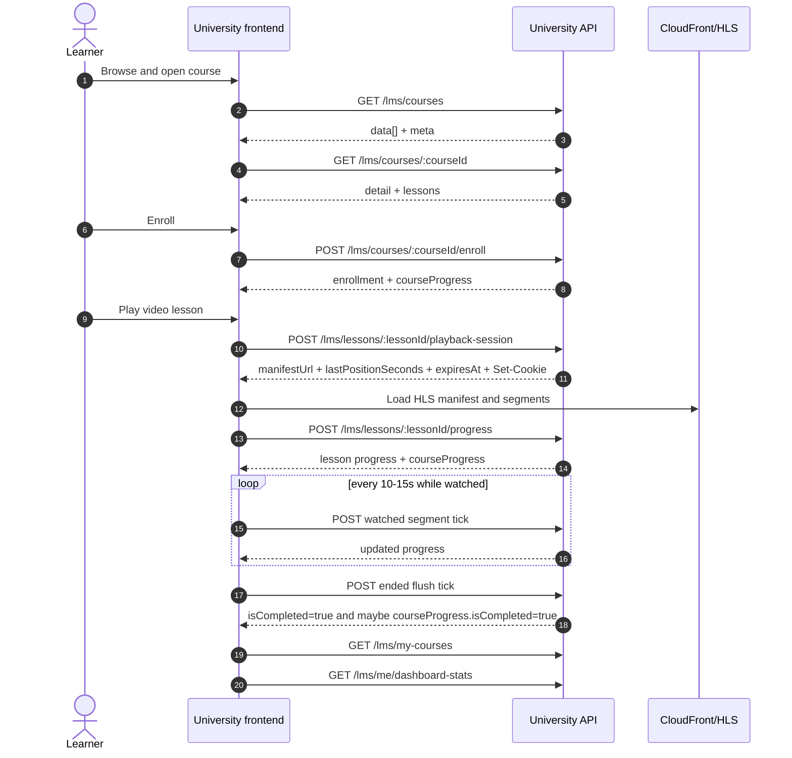
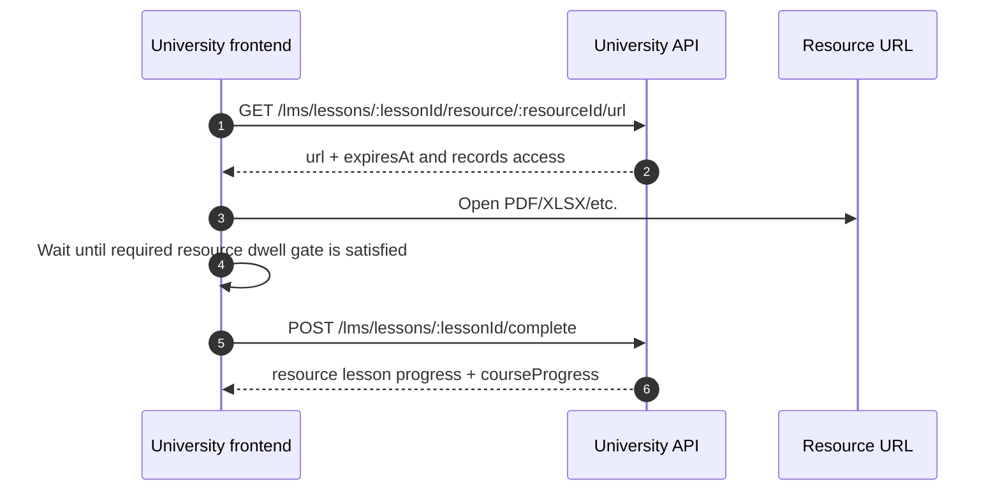

# Learner Core Flow

This is the main learner integration path: browse a course, enroll, open a
lesson, record progress, and react when the course completes.

Read [`../01-foundations.md`](../01-foundations.md) first. It defines the
shared `/api/v1` base URL, bearer auth, response envelopes, error envelopes,
pagination, IDs, timestamps, and rate-limit handling used below. Use Swagger
for the current endpoint schemas; this doc explains call order and UI behavior.

## Core route map

| Learner action | Endpoint | Frontend result |
| --- | --- | --- |
| Browse the catalog | `GET /lms/courses` | Paginated course cards with user-aware progress and bookmark state. |
| Open a course page | `GET /lms/courses/:courseId` | Full course detail with modules, launchable lesson summaries, media state, and resource summaries. |
| Render structure only | `GET /lms/courses/:courseId/curriculum` | Lightweight curriculum without learner progress or launch state. |
| Enroll | `POST /lms/courses/:courseId/enroll` | Enrollment and initial/existing course progress. |
| Render continue-learning list | `GET /lms/my-courses` | Paginated enrolled courses sorted by activity. |
| Start video playback | `POST /lms/lessons/:lessonId/playback-session` | HLS manifest URL, resume position, expiry, and playback cookies when enabled. |
| Record a watched segment | `POST /lms/lessons/:lessonId/progress` | Lesson progress and recomputed course progress. |
| Open a resource | `GET /lms/lessons/:lessonId/resource/:resourceId/url` | Short-lived resource URL and a recorded resource access event. |
| Complete a resource lesson | `POST /lms/lessons/:lessonId/complete` | Lesson completion and recomputed course progress. |
| Refresh learner dashboard totals | `GET /lms/me/dashboard-stats` | Lifetime totals plus recent rolling-window activity. |

The examples in `Docs/api-examples/` are the reusable learner payload examples:
`courses-list.json`, `course-detail.json`, `course-curriculum.json`,
`enrollment.json`, `my-courses.json`, and `progress.md`.

## Video completion sequence



## Browse the catalog

Call `GET /lms/courses` for the course library. It returns the standard
paginated envelope and only active courses.

| Query param | Use |
| --- | --- |
| `category` | Filter by course category. |
| `search` | Case-insensitive title/description search. Trimmed input must be 1 to 120 characters when present. |
| `mandatory` | `true` returns mandatory courses; `false` returns non-mandatory courses. |
| `bookmarked` | `true` returns bookmarked courses; `false` excludes bookmarked courses. |
| `page`, `pageSize` | Learner pagination from the foundations doc. |

Catalog results currently sort newest courses first, then title ascending as a
tie-breaker.

Catalog cards contain fields the frontend should treat as backend-derived:

| Field | Meaning |
| --- | --- |
| `coverImageUrl` | Frontend-ready cover URL. Do not reconstruct an S3 key. It may be `null`. |
| `popular` | Course is in the backend's current popular-course set based on enrollment counts. |
| `isNew` | Course was created inside the current 30-day new-course window. |
| `myProgress` | Current learner course progress summary or `null` when no progress row is available. |
| `isBookmarked` | Current learner bookmark state. |

`myProgress` is a course summary. It already includes required-lesson counts
for progress UI:

```json
{
  "percentage": 50,
  "status": "IN_PROGRESS",
  "isCompleted": false,
  "completedRequiredLessons": 2,
  "totalRequiredLessons": 4
}
```

## Open course detail

Use `GET /lms/courses/:courseId` for the learner course page that can launch
lessons. It extends the catalog card with ordered `modules` and `lessons`.

The lesson summary is intentionally not a playback session:

- Video lessons expose `mediaAsset` summary state. The player still calls the
  playback-session endpoint to receive the manifest URL and resume position.
- Resource lessons expose one singular `resource` summary when present. The
  frontend still calls the resource URL endpoint before opening the file.
- Lesson `description` is optional in course responses when a blank stored
  description is trimmed away.

Use `GET /lms/courses/:courseId/curriculum` only when the UI needs lightweight
course structure. Curriculum omits learner progress, bookmark state, instructor
data, media asset summary, resource summary, created timestamps, and updated
timestamps.

## Enroll and transition the UI

Call `POST /lms/courses/:courseId/enroll` when the learner chooses a course.
The operation is idempotent for the current user and course: backend upserts the
enrollment and ensures the matching course progress row exists.

On success, update the call-to-action from an enroll state to an open or
continue state using the returned enrollment and `courseProgress`. Repeating the
request should not create duplicate enrollment rows.

Expected blocking states include:

- `404` when the course ID does not exist.
- `409` when the course exists but is inactive.

## Render My Courses

Use `GET /lms/my-courses` for enrolled-course UI and continue-learning
surfaces.

By default the endpoint excludes `CANCELLED` enrollments. Pass `status` only
when a screen explicitly needs an `EnrollmentStatus` filter. Pagination follows
the learner convention from foundations.

The list is ordered by learning activity:

1. Course progress update time when there is progress activity.
2. Enrollment time when progress has not moved yet.
3. Stable backend tie-breakers after that.

Each row carries:

- `enrollment` metadata
- the nested `course` card data needed for the learner list
- `myProgress`
- `lastPlayedLesson` when course progress has a last lesson
- `lastActivityAt` for the ordering/UI timestamp

Use `lastPlayedLesson` to drive a continue target when present. When it is
`null`, the frontend should choose its normal first-lesson course entry path.

## Start video playback

When a learner selects a video lesson, call:

```text
POST /lms/lessons/:lessonId/playback-session
```

The endpoint checks that:

- the lesson exists and is a `VIDEO` lesson
- the course is active
- the learner is enrolled and not cancelled
- lesson media exists, is `READY`, and has a manifest path

Feed `manifestUrl` to the HLS player and resume from `lastPositionSeconds`.
The backend clamps the resume position to the video duration. `expiresAt`
describes the playback-session expiry window.

When signed cookies are enabled, this response sets CloudFront playback cookies
for the browser to send on CDN manifest and segment requests. The frontend
should not expect those cookie values inside the JSON body. If the frontend and
University API are different browser origins, make the playback-session request
with credentials enabled so the browser can accept those cookies, then verify
the CDN manifest and segment requests carry them. Local-domain and staging
cookie troubleshooting belongs in the local-dev integration doc.

The playback-session route is throttled at 10 requests per 60 seconds per user
and lesson. Reuse a successful session for the current load instead of treating
the endpoint as a polling route.

## Send progress ticks

Video progress is server-calculated from watched segments:

```text
POST /lms/lessons/:lessonId/progress
```

Send a tick every 10 to 15 seconds while the player is actively accumulating
watched time. Flush the currently watched interval on pause, before a seek, and
on video end.

```json
{
  "currentTime": 45,
  "duration": 300,
  "watchedFrom": 30,
  "watchedTo": 45
}
```

Tick rules:

- `watchedFrom` must be lower than `watchedTo`.
- One submitted interval must cover 60 seconds or less.
- The endpoint is rate-limited to one request per 5 seconds per user and
  lesson, so debounce flushes that would immediately follow a normal tick.
- Backend clamps submitted positions to lesson bounds before recomputing
  progress.
- Exact duplicate watched segments are idempotent.
- Backend merges watched intervals before calculating watched percentage.
- A video lesson completes when backend watched percentage reaches at least
  90%.

The response is the authoritative state after the tick:

```json
{
  "lessonId": "65fa8258-5156-44ef-bf51-3ffde9c10af8",
  "watchedSeconds": 270,
  "watchedPercentage": 90,
  "isCompleted": true,
  "completedAt": "2026-05-22T11:45:10.000Z",
  "lastPositionSeconds": 270,
  "courseProgress": {
    "percentage": 100,
    "status": "COMPLETED",
    "isCompleted": true,
    "completedRequiredLessons": 4,
    "totalRequiredLessons": 4
  }
}
```

Use the returned `lastPositionSeconds`, lesson completion flag, and
`courseProgress` instead of guessing completion from player-side percentage.

## Complete resource lessons

Resource lessons are a two-step flow.



First request the file URL:

```text
GET /lms/lessons/:lessonId/resource/:resourceId/url
```

That call requires enrollment, returns a short-lived URL, and records the
resource access event used by completion gating.

Then complete the resource lesson:

```text
POST /lms/lessons/:lessonId/complete
```

Required resource lessons cannot complete until 10 seconds after the recorded
resource access event. If the access event is missing, completion returns a
conflict telling the client to open the resource first. Resource lessons do not
send video progress ticks.

## React to lesson and course completion

Both video ticks and resource completion responses include the recomputed
`courseProgress` summary. Refresh course UI from that response immediately.

When `courseProgress.isCompleted` changes to `true`:

1. Mark the learner course state completed in the current UI.
2. Refresh any `GET /lms/my-courses` surface that shows continue-learning
   position or course status.
3. Refresh `GET /lms/me/dashboard-stats` when dashboard totals are visible.
4. Hand certificate readiness and download UX to the certificate flow doc.

Course completion also updates the enrollment status to `COMPLETED` and starts
certificate issuance work asynchronously. The learner-core UI should not block
completion feedback on certificate PDF availability.

## Dashboard stats

Use `GET /lms/me/dashboard-stats` for learner dashboard counters.

Top-level counters are current totals:

- `coursesInProgress`
- `completed`
- `totalLearningSeconds`
- `certificatesEarned`

`deltas` are recent rolling-window activity. Today the backend uses a 7-day
window and returns the window length as `deltas.windowDays`. These values are
not previous-period comparisons and should not be labeled as "vs last week."

## Frontend checklist

Before marking the learner flow integrated:

1. Use course UUIDs for detail, enroll, lesson, resource, and progress calls.
2. Use course detail for launch data and curriculum only for lightweight
   structure.
3. Transition the enroll CTA from the idempotent enroll response.
4. Start playback with the playback-session response, not course-detail media
   metadata.
5. Tick every 10 to 15 seconds, flush on pause/seek/end, and respect the
   5-second progress throttle.
6. Open resource URLs before resource completion and handle the 10-second
   required-resource dwell state.
7. Trust returned lesson and course progress for completion UI, then refresh
   affected My Courses and dashboard surfaces.
