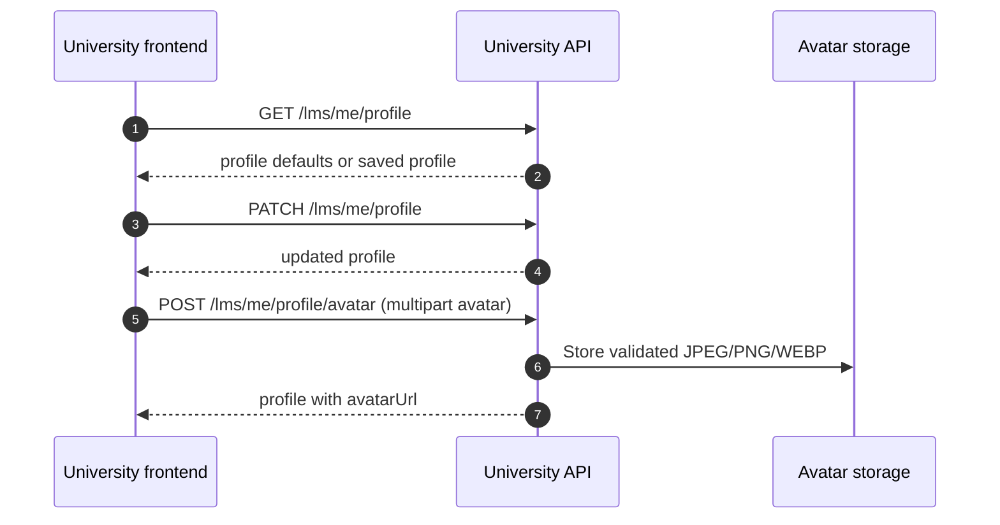

# Profile And Settings Flow

The University profile is the learner's LMS-specific settings record. It adds
profile extras, an LMS avatar override, notification preferences, and appearance
data around the dashboard identity carried by the bearer token.

Read [`../01-foundations.md`](../01-foundations.md) first for shared auth,
envelope, error, ID, and timestamp conventions. Use Swagger for current request
and response schemas; this doc explains the settings flow and its ownership
boundaries.

## Profile route map

| Frontend need | Endpoint | Contract |
| --- | --- | --- |
| Load settings | `GET /lms/me/profile` | Returns current user's LMS profile extras and creates defaults on first read. |
| Save settings fields | `PATCH /lms/me/profile` | Partial update; omitted fields are preserved. |
| Upload avatar override | `POST /lms/me/profile/avatar` | Multipart image upload under the `avatar` field. |

## Identity boundary

Do not use the LMS profile as the source of truth for dashboard identity.

| Data | Source to trust |
| --- | --- |
| Authenticated user ID | Bearer token `sub`, exposed as profile `userId` for joins. |
| Email | Dashboard JWT/auth state. |
| Display name fields | Dashboard JWT/auth state. |
| LMS job title, department, phone, bio | University profile. |
| LMS avatar override | University profile `avatarUrl` when present. |
| LMS notification and appearance preferences | University profile JSON fields. |

This separation matters for settings UI. A frontend screen can render dashboard
name/email beside LMS fields, but the University profile endpoints do not edit
those identity fields.

## Load the profile

Call:

```text
GET /lms/me/profile
```

The first successful read creates the profile row when one does not exist. A
new profile starts with empty JSON objects for `notificationPrefs` and
`appearance`, nullable profile text fields, no avatar override, and returned
timestamps for the stored row.

Treat the response as the initial settings form state. The frontend does not
need a separate "create profile" branch.

## Save editable fields

Call:

```text
PATCH /lms/me/profile
```

The request is partial. Omitted fields keep their current values.

| Field | Update rule |
| --- | --- |
| `jobTitle` | Trimmed string, `null`, or omitted. Maximum 120 characters. |
| `department` | Trimmed string, `null`, or omitted. Maximum 120 characters. |
| `phone` | Trimmed string, `null`, or omitted. Maximum 40 characters. |
| `bio` | Trimmed string, `null`, or omitted. Maximum 2000 characters. |
| `notificationPrefs` | JSON object or omitted. |
| `appearance` | JSON object or omitted. |

Use `null` when the learner intentionally clears one of the nullable text
fields. Use omission when the UI is not changing a field.

## Preference JSON ownership

`notificationPrefs` and `appearance` are open JSON objects. The backend stores
the objects and returns them; it does not validate an application-level schema
inside those fields today.

That gives the frontend room to evolve settings, but it also creates an
ownership rule:

1. Define the frontend shape in one settings model, not per screen.
2. Preserve unknown keys when that model needs forward compatibility.
3. Prefer one partial profile save that writes the current object for a
   settings group instead of several screens inventing competing keys.

The current Swagger examples show possible values such as notification booleans
or an appearance theme. They are examples, not backend-enforced enums.

## Upload an avatar

Call:

```text
POST /lms/me/profile/avatar
```

Send multipart form data with one file field named `avatar`.

| Rule | Current backend behavior |
| --- | --- |
| Size | Maximum 5 MB. |
| Accepted image types | JPEG, PNG, or WEBP. |
| Validation | Backend inspects image bytes, not only the browser-provided MIME header. |
| Storage result | New S3 key is stored as `avatarS3Key`. |
| Frontend image URL | Returned as `avatarUrl` when the CDN URL can be built. |

Use the returned profile response as the post-upload source of truth. Do not
reconstruct a public URL from `avatarS3Key` in frontend code.

Common upload failure branches:

| HTTP status | Typical cause |
| --- | --- |
| `400` | Missing file or unsupported image bytes. |
| `401` | Missing or expired bearer token. |
| `413` | File exceeded the 5 MB upload limit. |
| `422` | Request validation failed before service handling. |
| `503` | Required S3 or CloudFront configuration is missing on the API environment. |

## Settings save sequence



## Frontend checklist

Before marking profile/settings integrated:

1. Load `GET /lms/me/profile` directly instead of creating a separate bootstrap
   profile flow.
2. Keep dashboard identity fields out of the University profile patch payload.
3. Use `null` for deliberate text-field clears and omission for untouched
   fields.
4. Treat preference JSON as frontend-owned state and keep its shape centralized.
5. Upload only through multipart `avatar` and render the returned `avatarUrl`.
