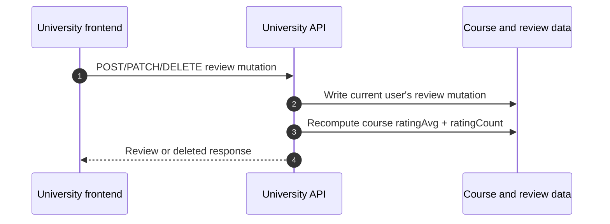

# Reviews, Bookmarks, And Notes Flow

Reviews, bookmarks, and lesson notes are small learner interactions with
different backend rules. Reviews affect course rating aggregates, bookmarks are
idempotent state toggles, and lesson notes are private enrollment-gated content.

Read [`../01-foundations.md`](../01-foundations.md) first for shared auth,
envelope, pagination, error, and ID handling. The course card fields referenced
below are introduced in [`learner-core.md`](./learner-core.md).

## Route map

| Frontend need | Endpoint | Contract |
| --- | --- | --- |
| Create a course review | `POST /lms/courses/:courseId/reviews` | One review per current user and course. |
| Edit current user's review | `PATCH /lms/courses/:courseId/reviews/mine` | Partial review update. |
| Delete current user's review | `DELETE /lms/courses/:courseId/reviews/mine` | Deletes review and recomputes aggregates. |
| List course reviews | `GET /lms/courses/:courseId/reviews` | Paginated newest-first review list. |
| Bookmark course | `POST /lms/courses/:courseId/bookmark` | Idempotently marks the course bookmarked. |
| Remove bookmark | `DELETE /lms/courses/:courseId/bookmark` | Idempotently clears the bookmark. |
| Load lesson note | `GET /lms/lessons/:lessonId/notes` | Returns stored note or an empty editor state. |
| Save lesson note | `PUT /lms/lessons/:lessonId/notes` | Upserts replacement note content. |

## Course review lifecycle

The review screen has two permission levels:

| Action | Backend gate |
| --- | --- |
| List reviews | Course must exist and be active. |
| Create, update, or delete the current user's review | Course must be active and the current user must have a non-cancelled enrollment. |

Write endpoints only act on the current user. There is no frontend-supplied
review ID for editing or deleting "mine".

### Create

Call:

```text
POST /lms/courses/:courseId/reviews
```

Payload rules:

| Field | Rule |
| --- | --- |
| `rating` | Required integer from 1 through 5. |
| `comment` | Optional trimmed string, maximum 2000 characters. Empty string becomes omitted on create. |

Only one review can exist for a `(user, course)` pair. If a learner already
reviewed the course, create returns a conflict instead of silently replacing the
existing review. Route that UI into edit mode.

### Update mine

Call:

```text
PATCH /lms/courses/:courseId/reviews/mine
```

Send at least one of `rating` or `comment`.

| Field | Rule |
| --- | --- |
| `rating` | Optional integer from 1 through 5. |
| `comment` | Optional trimmed string or `null`, maximum 2000 characters. Empty string becomes `null` on update. |

Update returns not found when the user has no review to update. Cancelled
enrollments cannot mutate existing reviews.

### Delete mine

Call:

```text
DELETE /lms/courses/:courseId/reviews/mine
```

The response tells the frontend deletion succeeded:

```json
{
  "data": {
    "deleted": true
  }
}
```

Deleting requires the same reviewable enrollment gate as update.

### List reviews

Call:

```text
GET /lms/courses/:courseId/reviews
```

The endpoint uses learner pagination from the foundations doc. Reviews sort by
`createdAt` descending with a stable ID tie-breaker.

Review rows include `userId`, but the University API does not enrich them with
dashboard profile identity. Frontend review presentation should not assume this
endpoint returns learner display names or avatars.

## Rating aggregate timing

Course `ratingAvg` and `ratingCount` are recomputed in the same transaction as
review create, update, and delete.



The mutation response is authoritative for the review record. If the current
screen also shows catalog or course-detail rating fields, refresh that course
data after the mutation instead of guessing the average in UI state.

## Bookmark toggle

Bookmarks are simple course state transitions:

```text
POST /lms/courses/:courseId/bookmark
DELETE /lms/courses/:courseId/bookmark
```

Both endpoints require an active course and both are idempotent. Repeating
`POST` keeps the course bookmarked; repeating `DELETE` keeps it unbookmarked.

The response carries the resulting state:

```json
{
  "data": {
    "courseId": "449ea4e0-a077-45ea-9d47-622fc41ebdf5",
    "bookmarked": true
  }
}
```

Use that value to settle optimistic UI. Catalog and my-courses payloads expose
their own `isBookmarked` snapshot, and the catalog endpoint can filter with
`bookmarked=true` or `bookmarked=false`.

## Lesson notes

Lesson notes are private to the current user and lesson. They require lesson
access: the lesson must exist in an active course and the current user must be
enrolled without a cancelled enrollment.

### Load note editor state

Call:

```text
GET /lms/lessons/:lessonId/notes
```

When no saved note exists yet, the endpoint returns an editor-ready empty state
instead of `404`:

```json
{
  "data": {
    "lessonId": "65fa8258-5156-44ef-bf51-3ffde9c10af8",
    "courseId": "449ea4e0-a077-45ea-9d47-622fc41ebdf5",
    "content": "",
    "createdAt": null,
    "updatedAt": null
  }
}
```

A persisted note adds `id` and stored timestamps.

### Save note content

Call:

```text
PUT /lms/lessons/:lessonId/notes
```

`PUT` upserts and replaces the note content for the current user and lesson:

```json
{
  "content": "Remember to compare this with the brief template."
}
```

`content` can be an empty string and must be at most 10000 characters. The API
does not expose note deletion separately today; an empty saved content value is
the current clear path.

## Frontend checklist

Before marking these interactions integrated:

1. Keep review list permissions separate from review write permissions.
2. Move duplicate-review create conflicts into edit behavior instead of retrying
   create.
3. Refresh rating-bearing course data after review mutations when it is visible.
4. Set bookmark state from the mutation response and refresh filtered lists when
   a bookmarked-only view is open.
5. Treat missing notes as an empty editor state and save notes with replacement
   `PUT` semantics.
