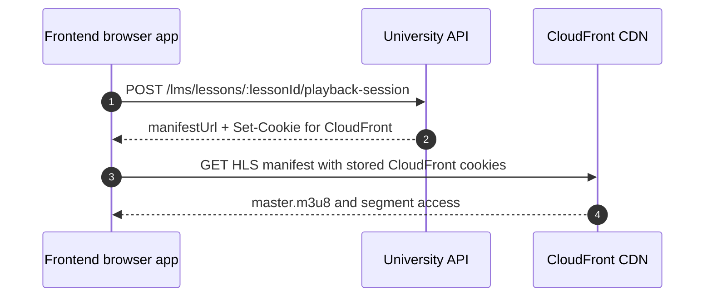

# Local Dev And Staging Cookbook

This guide gets a frontend engineer from "the University API is running
somewhere" to "a real learner flow plays video in my browser." The awkward part
is media playback: the API uses bearer auth for protected endpoints, then
CloudFront signed cookies for HLS manifests and segments when signed-cookie
delivery is enabled.

Read [`01-foundations.md`](./01-foundations.md) first for API base URL, bearer
auth, envelopes, CORS context, and HTTP error handling. Read
[`02-flows/learner-core.md`](./02-flows/learner-core.md) for the playback,
resource, and progress flow after connectivity is working.

## Choose an integration mode

Pick the mode before debugging playback.

| Mode | Best for | Proves |
| --- | --- | --- |
| Local FE against staging University API | Real browser playback against seeded AWS/CDN infrastructure. | Protected staging API, CloudFront URL wiring, and signed-cookie behavior when the environment domains line up. |
| Local FE against local API with `DISABLE_SIGNED_COOKIES=true` | Fast learner-screen work and API contract iteration. | API integration and unsigned CloudFront media URL flow. |
| Domain-aligned local hosts | Debugging browser domain/cookie behavior with local services. | Domain alignment mechanics only unless media/CDN cookie config is also aligned. |

The quickest path for ordinary screens is a local API with signed cookies
disabled. The path that matters before claiming protected video integration is
the signed-cookie path in staging or another domain-aligned environment.

## Why localhost is awkward for playback

Production-style media uses three browser-facing hosts that share a parent
domain:

| Role | Example host |
| --- | --- |
| Frontend | `university.swiftnine.com` |
| University API | `university-api.swiftnine.com` |
| CloudFront CDN | `cdn.swiftnine.com` |

The playback-session endpoint returns JSON with `manifestUrl` and, when signed
cookies are enabled, sets these HTTP-only CloudFront cookies:

- `CloudFront-Policy`
- `CloudFront-Signature`
- `CloudFront-Key-Pair-Id`

The API cookie domain is configured with `CLOUDFRONT_COOKIE_DOMAIN`, normally
`.swiftnine.com`. A browser page on plain `localhost` does not turn that into a
real `.swiftnine.com` browser context by wishful thinking. Cookie acceptance and
cookie delivery must work across the frontend, API, and CDN domains involved in
the test.



If the first call succeeds but the browser never stores or sends the cookies to
the CDN, HLS fails later. That failure is not a progress endpoint problem.

## Option A: use staging for signed-cookie playback

Use staging when the goal is to prove real protected media delivery.

1. Point the frontend API client at the staging University base URL, including
   `/api/v1`.
2. Obtain a current dashboard-issued bearer token for the test user.
3. Load the catalog, enroll in a seeded course if needed, and open a video
   lesson.
4. Make the playback-session request with credentials enabled in the browser
   whenever frontend and API origins differ.
5. Confirm browser dev tools show the API `Set-Cookie` response and confirm CDN
   manifest and segment requests carry the CloudFront cookies.

The milestone staging host examples are:

```text
https://university-api-staging.swiftnine.com/api/v1
https://university-staging.swiftnine.com
```

Use the actual deployed handoff values for the environment you are testing.
They must be configured so API-issued CloudFront cookies are valid for the CDN
domain used by `manifestUrl`.

## Option B: run local API with signed cookies disabled

This is the pragmatic local mode for most frontend work.

Backend env:

```env
NODE_ENV=development
FRONTEND_ORIGIN=http://localhost:3000
DISABLE_SIGNED_COOKIES=true
```

The current media service behavior in this mode is:

| Media surface | Behavior |
| --- | --- |
| Video playback session | Returns `manifestUrl` without setting CloudFront playback cookies. |
| Resource URL endpoint | Returns an unsigned CloudFront resource URL instead of a signed URL. |
| Progress and completion | Same University API endpoints and rules as other modes. |

This is still CloudFront URL behavior, not a direct private S3 URL mode. The
development CDN behavior must allow the unsigned media path being tested.

Use this mode to build:

- catalog, course detail, enrollment, and my-courses screens
- player plumbing around `manifestUrl`, resume position, and progress ticks
- resource lesson UI
- profile, reviews, bookmarks, certificates, and admin JSON screens when the
  local data exists

Do not use this mode as evidence that production signed-cookie acceptance is
working.

## Option C: align local domains

Use a domain-aligned local setup when the problem being debugged is browser
domain behavior rather than endpoint shape.

Two common patterns:

1. Use `localtest.me` hostnames that resolve to `127.0.0.1`, such as frontend
   and API names under the same parent host.
2. Add explicit local hostnames to `/etc/hosts`, then run the frontend and API
   under those names.

The M9 milestone examples are:

```text
university.localtest.me
university-api.localtest.me
```

Domain alignment alone does not create a CloudFront-equivalent protected HLS
environment. To test the signed-cookie path, the configured cookie domain, API
host, and CDN host still need to agree with the browser context. Otherwise use
staging for the protected-media proof and keep local work in Option B.

## Frontend configuration checklist

The frontend side needs these concepts wired before screen debugging:

| Frontend value | Requirement |
| --- | --- |
| University API base URL | Include `/api/v1`, for example `{host}/api/v1`. |
| Bearer token | Use the current dashboard-issued access token. University API does not issue or refresh it. |
| Playback-session browser request | Enable credentials when the API response must set signed cookies across origins. |
| CDN debugging | Inspect manifest and segment requests separately from the JSON API request. |

A good first probe is:

```text
GET {UNIVERSITY_API_BASE_URL}/health/authed
```

with:

```http
Authorization: Bearer <dashboard-access-token>
```

If that fails, fix base URL or auth before debugging courses or playback.

## Backend env knobs FE should understand

Frontend engineers do not need to own backend env, but these values explain
most pairing-session surprises:

| Backend env | Why it matters |
| --- | --- |
| `FRONTEND_ORIGIN` | Controls configured CORS origins. Required in production. |
| `JWT_ACCESS_SECRET` | Must match the dashboard access-token secret. |
| `CLOUDFRONT_DOMAIN` | Builds media and cover URLs returned by the API. |
| `CLOUDFRONT_COOKIE_DOMAIN` | Domain scope for CloudFront playback cookies. |
| `SIGNED_COOKIE_TTL_SECONDS` | Playback cookie/session expiry window, default 3600 seconds. |
| `DISABLE_SIGNED_COOKIES` | Bypasses signed-cookie media delivery for local/dev behavior when true. |

Development CORS is permissive when `FRONTEND_ORIGIN` is absent. Production
fails closed at boot if `FRONTEND_ORIGIN` is missing, and configured production
CORS should only allow the intended frontend origins.

## First successful playback path

Use this short path after the frontend knows its API base URL and bearer token:

1. Call `GET /health/authed`.
2. Call `GET /lms/courses`.
3. Open a course detail and select a seeded video lesson.
4. Call `POST /lms/courses/:courseId/enroll` if the test user is not already
   enrolled.
5. Call `POST /lms/lessons/:lessonId/playback-session`.
6. Feed the returned `manifestUrl` to the HLS player.
7. In signed-cookie mode, verify cookie storage and CDN cookie delivery before
   debugging player code.
8. Once video plays, follow learner-core guidance for progress ticks and
   completion.

## Symptom triage

| Symptom | Likely cause | First check |
| --- | --- | --- |
| Browser says the request was blocked by CORS and frontend cannot read the API response | Browser origin is not allowed by API CORS or environment origin config is wrong. | Check frontend origin and backend `FRONTEND_ORIGIN`; verify whether this is development or production behavior. |
| API returns `401` | Bearer token missing, expired, invalid, or signed with a mismatched dashboard secret. | Probe `/health/authed` with the same token. |
| API returns `403` on learner media or notes | User is not allowed for that action, often missing/cancelled enrollment. | Check enrollment state and endpoint-specific flow doc. |
| Admin endpoint returns `403` | Authenticated user has no `lms_admins` row. | Use the admin handoff user or seed the admin row for that test user. |
| Playback session succeeds but no CloudFront cookies appear in browser storage | Request credentials/domain/cookie config mismatch. | Confirm signed-cookie mode, credentials-enabled browser request, API host, cookie domain, and browser dev-tools `Set-Cookie` handling. |
| CDN HLS manifest or segment returns `403` in signed-cookie mode | Cookies did not reach the CDN, expired, or path/key-group config does not match. | Inspect CDN request cookies and compare `manifestUrl` domain/path with environment media config. |
| Playback session returns conflict about media | Lesson media is not seeded, not ready, not a video, inactive, or missing manifest data. | Try a known seeded video lesson and inspect the response message. |
| Unsigned local video URL still fails | Dev CDN behavior does not allow that unsigned path or media is missing. | Confirm `DISABLE_SIGNED_COOKIES=true`, returned URL domain, and seeded CloudFront objects. |

`401`, `403`, browser CORS blocking, and CDN `403` are different failure
families. Classify the failure before changing API-client code.

## Staging handoff values

This repository does not currently contain durable staging credentials, a
sample dashboard JWT, or a guaranteed staging course inventory. Do not hardcode
made-up credentials into the frontend integration path.

Before a frontend handoff, the backend/dashboard owner should fill or provide:

| Needed value | Handoff note |
| --- | --- |
| Staging University API base URL | Must include `/api/v1`. |
| Staging frontend origin | Must match environment CORS and cookie testing intent. |
| How FE gets a fresh dashboard JWT | Dashboard dev mode, test helper, or documented login path. |
| Seeded playable course | Course title/UUID or clear catalog selection guidance. |
| Seeded video lesson | Lesson selection that reaches a `READY` media asset. |
| Admin test user | Dashboard user whose UUID has a matching `lms_admins` row, only if admin FE is being integrated. |

AWS setup notes already describe how to insert the first admin row once the
dashboard JWT subject is known.

## Local integration checklist

Before claiming the first backend connection works:

1. Confirm the API base URL includes `/api/v1`.
2. Confirm `/health/authed` works with a current dashboard bearer token.
3. Confirm the catalog and one course detail load.
4. Confirm the chosen test lesson has seeded playable media.
5. State which playback mode is active: staging signed cookies, local unsigned
   dev media, or domain-aligned cookie debugging.
6. Verify signed-cookie browser storage and CDN delivery in staging or another
   real domain-aligned environment before calling protected playback complete.
