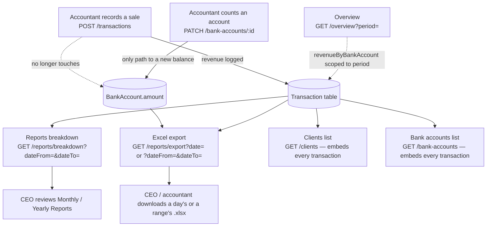

# Accounting Flow Changes — Balances, Reports, Export

**Status:** shipped and verified end-to-end against a real seeded workspace over real HTTP (not mocked, not raw SQL), across several rounds of follow-up fixes. See [Verification](#verification) for the actual runs.
**Related docs:** `docs/accounting-reports-spec.md` (the gap analysis this work closes), `docs/accounting-workspace-migration-changes.md` (dated Follow-up entries with full technical detail per change — this doc is the readable summary, that one is the ledger).

---

## 1. Why this changed

The accountant used to record a sale and have it silently push a bank account's stored balance up or down. In practice, balances need to reflect what the accountant actually counted in the account — not a running total of sales that might be edited or deleted later. So the two were split apart:

- **Recording a sale** is now purely a revenue record.
- **A bank account's balance** changes only when the accountant deliberately sets it.

Separately, the Reports section (daily/monthly/yearly, and an Excel export) didn't exist in a form that could answer "what happened during a specific period" — every breakdown on the Overview screen was all-time only. This work builds that out, then extends it across two more rounds of follow-ups: embedding transaction detail into the Clients and Bank Accounts lists, letting Overview's bank-account panel itself respect a period filter, and letting the Excel export cover a range of days instead of just one.

---

## 2. The flow, end to end



The dotted line from **A** is the point of the first change: **sales and balances no longer talk to each other automatically.** The dotted line from **K** is the point of a later one: Overview's bank-account panel is no longer silently all-time either.

---

## 3. What changed, in order

### 3.1 Transactions no longer move balances

`transaction.service.ts` — `create()`, `update()`, `remove()` each used to also write to `BankAccount.amount` (increment on create, reverse-then-reapply on update, reverse on delete). All of that is gone. Each method now does exactly one write: the `Transaction` row itself.

`bankAccountId` is still required on every transaction and still validated against the account's currency — it's just a label now ("this sale came in through Whop"), not a balance instruction.

**The only remaining way a balance changes:** `PATCH /bank-accounts/:id`, unchanged, already existed before this work.

### 3.2 Reports can now be scoped to a period

Three of the aggregations behind the Overview screen — revenue by bank account, revenue by currency, and top clients — used to only ever answer "all-time." A new endpoint layers a date-scoped version of the same math on top:

```
GET /accounting-dashboard/reports/breakdown?dateFrom=YYYY-MM-DD&dateTo=YYYY-MM-DD
```

Pass the same date twice for a single day, a full month for Monthly Reports, a full year for Yearly Reports — one endpoint, three screens. Capped at 400 days per request so it can't be used to scan a workspace's whole history in one call.

Top clients are ranked here by actual summed transaction revenue in the period — not by the `Clients.totalRevenue` field Overview's version uses (that field is hand-entered and known to drift from real activity; left untouched here on purpose, see `accounting-reports-spec.md` §4.2).

### 3.3 Excel export — a day, a range, and now a clear label either way

```
GET /accounting-dashboard/reports/export?date=YYYY-MM-DD
GET /accounting-dashboard/reports/export?dateFrom=YYYY-MM-DD&dateTo=YYYY-MM-DD
```

Either `date` (single day, optional, defaults to today UTC) **or** `dateFrom`/`dateTo` together (a range, capped at 400 days) — never both, and never just one side of a range. Returns a real `.xlsx`, not JSON, with four sheets:

| Sheet | What's in it |
|---|---|
| Transactions | Every sale in range — ref ID, date, client, bank account, currency, amount, description |
| Sales Summary | One row per day in range (zero-filled on quiet days), plus a bold **Total** row once the range spans more than one day |
| Balances by Account | Every account's **current** balance, zero-filled for every currency with an account even if it had no sales in range — explicitly labeled current, since there's no historical ledger to answer "what was the balance back then" |
| Revenue Breakdown | Two tables: revenue by currency, and revenue by bank account, both scoped to the exported period |

Every sheet opens with a bold title row — `Report date: 2026-08-18` for a single day, or `Report period: 2026-08-01 to 2026-08-18` for a range — so the file still makes sense once saved, renamed, or reopened weeks later.

### 3.4 Clients and bank accounts now embed every linked transaction

`GET /clients` and `GET /bank-accounts` return every linked transaction per row now, not just an aggregate:

- **Clients**: each client's `transactions` array includes the full detail (amount, currency, date, ref ID, description) plus which **bank account** the payment came in through — the closest available stand-in for "payment method" now that there's no payment-platform field. This used to only be true for `GET /clients/:clientId`; the list endpoint stripped transactions down to just enough to compute a total. Now both match.
- **Bank accounts**: had no transaction embedding at all before. Each account's `transactions` array now includes the full detail plus which **client** it came from — the mirror image of the clients change.

Known tradeoff, not addressed: this embeds every transaction, unpaginated, on every list row. Fine for the data volumes seen so far; worth revisiting if a client or account ever accumulates a very large transaction history.

### 3.5 Overview's bank-account panel now respects the `period` filter

`GET /accounting-dashboard/overview?period=` always accepted `daily`/`weekly`/`monthly`/`yearly`, but only used it to size the revenue chart's buckets — `revenueByBankAccount` was silently all-time regardless of what `period` you passed. It now scopes to a real current window:

| `period` | Window |
|---|---|
| `daily` | Today |
| `weekly` | Trailing 7 days including today (rolling, not a calendar week) |
| `monthly` | Month-to-date |
| `yearly` | Year-to-date |

`revenueByCurrency` and `topClients` were deliberately left untouched — still all-time on `/overview` no matter what `period` you pass.

---

## 4. Verification

None of this was unit-tested-only — every round was run against a real seeded workspace, over real HTTP, with a real login, and (for the export) the actual `.xlsx` was downloaded and parsed back to confirm its contents.

**Seed:** a dedicated demo workspace ("Demo — Accounting Flow"), 3 bank accounts (Whop/USD, Slash/USD, HBL/PKR), 3 clients, and 15 transactions spread across today, earlier this month, and last month.

**Balance decoupling, proven live:**

```
GET /bank-accounts  →  Whop 18,400.00 USD · Slash 7,200.00 USD · HBL 1,250,000.00 PKR
```

Exactly the seeded starting balances — after 15 transactions were created through the real `POST /transactions` endpoint. Nothing moved them.

**Reports breakdown, three different windows, three different (correct) answers:**

| Window | Whop (USD) | Slash (USD) | HBL (PKR → USD) |
|---|---|---|---|
| All-time (`/overview`, pre-3.5) | 9,750 · 6 sales | 9,500 · 5 sales | 237,000 → 852.52 · 4 sales |
| This month (`/reports/breakdown`) | 6,250 · 4 sales | 5,550 · 3 sales | 120,000 → 431.65 · 2 sales |
| Today only (`/reports/breakdown`) | 1,200 · 1 sale | 850 · 1 sale | 42,000 → 151.08 · 1 sale |

**Overview's `period` filter (3.5), all four values, same three accounts:**

| `period` | Whop | Slash | HBL |
|---|---|---|---|
| `daily` | 1,200 / 1 | 850 / 1 | 42,000 (151.08) / 1 |
| `weekly` | 3,600 / 2 | 2,450 / 2 | 42,000 (151.08) / 1 |
| `monthly` | 6,250 / 4 | 5,550 / 3 | 120,000 (431.65) / 2 |
| `yearly` | 9,750 / 6 | 9,500 / 5 | 237,000 (852.52) / 4 |

`monthly` and `yearly` match the `/reports/breakdown` and pre-change all-time rows above exactly. `revenueByCurrency` confirmed byte-for-byte identical between `period=daily` and `period=yearly` — proving it correctly stayed all-time, not accidentally scoped along with `revenueByBankAccount`.

**Excel export, single date and range, downloaded and parsed back:**

`?date=2026-08-18` — 9,572-byte `.xlsx`, confirmed as a genuine "Microsoft Excel 2007+" file:

```
Transactions:        DEMO-0001 Victoria Partners · Whop · USD 1200
                      DEMO-0002 Anton Enne · Slash · USD 850
                      DEMO-0003 Phase Shop · HBL · PKR 42000
Sales Summary:        2026-08-18 · $2,201.08 total · 3 sales · $733.69 avg
Balances by Account:  HBL 1,250,000 PKR ($4,496.40) · Whop $18,400 · Slash $7,200
Revenue Breakdown:    USD $2,050 (93.14%) · PKR 42,000 ($151.08, 6.86%)
                      Whop $1,200 · Slash $850 · HBL 42,000 PKR ($151.08)
```

`?dateFrom=2026-08-01&dateTo=2026-08-18` — Sales Summary rendered 18 daily rows (zero-filled on quiet days) plus a Total row of **12,231.65 / 9 sales / 1,359.07 avg**, matching `period=monthly` above exactly (6,250 + 5,550 + 431.65 = 12,231.65; 4 + 3 + 2 = 9). All four sheets titled `Report period: 2026-08-01 to 2026-08-18`.

A day with only 1 of 3 accounts active was exported separately to confirm the currency zero-fill: PKR showed `0 | 0 | 0` in Revenue by Currency instead of silently vanishing.

Validation checked live, each returning `422`: `date` + `dateFrom` passed together; `dateFrom` without `dateTo`; `dateFrom` after `dateTo`; a >400-day span.

**Clients / bank accounts embedding (3.4):** `GET /clients?limit=1` returned a client with all 5 of its transactions embedded (each with its `bankAccount`), matching `_count.transactions`. `GET /bank-accounts?limit=1` returned an account with all 4 of its transactions embedded (each with its `client`). Single-item (`GET /clients/:id`, `GET /bank-accounts/:id`) and a fresh `POST /bank-accounts` (empty `transactions: []`, no error) all confirmed working the same way.

**Static checks:** `tsc --noEmit`, `eslint`, `nest build` all clean throughout every round.

---

## 5. Where this lives in code

| Piece | File |
|---|---|
| Balance decoupling | `apps/api/src/transactions/transaction.service.ts` |
| Reports breakdown, Overview period scoping, export data gathering | `apps/api/src/accounting-dashboard/accounting-dashboard.service.ts` (`getReportsBreakdown`, `getExportData`, `getCurrentPeriodRange`, `getTopClientsByRevenue`, `buildDailyBreakdown`, `utcDayRange`) |
| Reports + export routes, Overview route | `apps/api/src/accounting-dashboard/accounting-dashboard.controller.ts` |
| Excel rendering | `apps/api/src/accounting-dashboard/report-export.service.ts` |
| Reports/export query & response DTOs | `apps/api/src/accounting-dashboard/dto/reports-breakdown-*.dto.ts`, `dto/export-report-query.dto.ts` |
| Clients transaction embedding | `apps/api/src/clients/clients.constants.ts`, `clients.service.ts`, `dto/client-response.dto.ts` |
| Bank accounts transaction embedding | `apps/api/src/bank-accounts/bank-account.constants.ts`, `bank-account.service.ts`, `dto/bank-account-response.dto.ts` |

All endpoints stay behind the same guard chain as the rest of this module: `JwtAuthGuard` + `WorkspaceGuard` + `AccountingRoleGuard`, requiring the `x-workspace-id` header and a CEO or ACCOUNTANT accounting role (writes are ACCOUNTANT-only).

## 6. Not done (open, on purpose)

- **No historical balance snapshots.** Every "balance" shown anywhere is current, never as-of-a-past-date — there's no ledger table to make that truthful yet. Flagged as an open product decision in `accounting-reports-spec.md` §5.
- **`Clients.totalRevenue` drift is unresolved.** Overview's top-clients panel still uses that hand-entered field; the period-scoped `/reports/breakdown` top-clients list uses real transaction sums instead, but the two aren't reconciled.
- **No "submit a report" workflow.** Reports are computed live on every request, same as before.
- **`revenueByCurrency` and `topClients` on `/overview` are still all-time**, unlike `revenueByBankAccount` — not extended to respect `period`, since it wasn't asked for.
- **Clients/bank-accounts transaction lists are unpaginated** — see 3.4.
